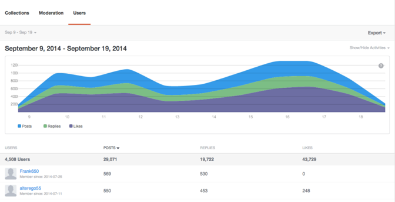

# Analytics{#analytics}

Analyser l’activité des utilisateurs, du contenu et du modérateur pour votre site.

## Analytics {#topic_22D8FAE581CD440EA02B1595520F60C2}

Analyser l’activité des utilisateurs, du contenu et du modérateur pour votre site.

Livefyre Analytics donne accès à vos données réseau dans des tableaux de bord faciles à lire pour les données de conversation, de modération et d’utilisateur. Utilisez ces tableaux de bord pour surveiller l’activité et exécuter des analyses rapides sur votre ou vos sites.

Les tableaux de bord peuvent être filtrés par site, date et activité. Utilisez la liste déroulante Réseau en haut à gauche de la fenêtre pour sélectionner un site à afficher. Une fois le graphique généré, cliquez sur l’en-tête d’une colonne à trier ou placez le pointeur de la souris sur le graphique pour obtenir des informations plus précises sur un point de données.

Cette page décrit :

* Sélection d’une plage [de](https://answers.livefyre.com/livefyre-studio-version-1/studio/analytics/#DateRange) dates pour votre tableau de bord
* [Affichage / Masquage des activités disponibles](https://answers.livefyre.com/livefyre-studio-version-1/studio/analytics/#ShowHideActivities)
* [Exportation des données du tableau de bord](https://answers.livefyre.com/livefyre-studio-version-1/studio/analytics/#ExportDashboardData)
* [Tableau de bord Collections](https://answers.livefyre.com/livefyre-studio-version-1/studio/analytics/#CollectionsDashboard)
* [Tableau de bord Modération](https://answers.livefyre.com/livefyre-studio-version-1/studio/analytics/#ModerationDashboard)
* [Tableau de bord Utilisateurs](https://answers.livefyre.com/livefyre-studio-version-1/studio/analytics/#UsersDashboard)

>[!NOTE]
>
>Analytics prend actuellement en charge les activités issues des applications de base Livefyre et de la modération. La plupart des activités incluses dans ces tableaux de bord sont également disponibles via les événements [JavaScript](https://answers.livefyre.com/developers/reference/app-customizations/javascript-events/)Livefyre, qui peuvent être utilisés pour alimenter votre propre outil d’analyse personnalisé ou tiers.

## Période {#concept_798C438120E643B6BE262C9997DC87C4}

Cliquez sur la liste déroulante des dates pour sélectionner une plage à afficher. Utilisez les dates rapides ou sélectionnez une date de début et de fin dans les calendriers fournis.

Dates rapides :

* **** Aujourd'hui : Affiche les données à partir de minuit le matin du jour en cours, jusqu’à la dernière heure complète avant ce moment.
* **** Hier : Affiche les données des 24 heures précédentes.
* **** 7 jours : Affiche les données des 7 jours précédents, à l’exception d’aujourd’hui.
* **** 30 jours : Affiche les données des 30 jours précédents, à l’exception d’aujourd’hui.
* **** Cette semaine : Affiche les données à partir de minuit le matin du dimanche dernier, jusqu’à la dernière heure complète avant ce moment.
* **** Ce mois-ci : Affiche les données à partir de minuit le matin du premier jour du mois en cours, jusqu’à la dernière heure complète avant ce moment.
* **** Semaine dernière : Affiche les données de la semaine dernière.
* **** Mois dernier : Affiche les données du mois dernier.

## Affichage/masquage des activités {#concept_022D9851CBCE4A2FB80D0AE52A23744D}

Les activités sont des actions que les utilisateurs exécutent sur votre site, y compris la création de commentaires, le marquage, le partage et la modération. Utilisez la liste déroulante **Afficher/Masquer les activités** pour sélectionner les activités à inclure dans votre tableau de bord.

>[!NOTE]
>
>Si vous sélectionnez de nouveaux événements pour le filtre, la page sera rendue à nouveau sans modifier l’URL.

Les activités disponibles varient en fonction du type de tableau de bord et de l’exportation et peuvent inclure :

* **** Publications : Affiche les données à partir de minuit le matin du jour en cours, jusqu’à la dernière heure complète avant ce moment.
* **** Réponses : Affiche les données des 24 heures précédentes.
* **** Mentions J’aime : Affiche les données des 7 jours précédents, à l’exception d’aujourd’hui.
* **** N’aime pas : Affiche les données des 30 jours précédents, à l’exception d’aujourd’hui.
* **** Contient le média : Affiche les données à partir de minuit le matin du dimanche dernier, jusqu’à la dernière heure complète avant ce moment.
* **** La publication a été téléchargée avec des photos : Affiche les données à partir de minuit le matin du premier jour du mois en cours, jusqu’à la dernière heure complète avant ce moment.
* **** La publication comporte un lien : Affiche les données de la semaine dernière.
* **** La publication comporte @mentions : Affiche les données du mois dernier.
* **** Approuvé : Affiche les données du mois dernier.
* **** Bozo'd : Affiche les données du mois dernier.
* **** Blocage : Affiche les données du mois dernier.
* **** Modération totale : Affiche les données du mois dernier.

## Exportation des données du tableau de bord {#concept_730DB61A9F894BE6BFB34E0E2A421ED3}

Utilisez le menu déroulant **Exporter** pour exporter vos données de tableau de bord au format CSV.

* Résumé quotidien (collections uniquement) : exporte les comptes quotidiens de la dernière semaine complète pour chaque collection.
* Données tabulaires : exporte toutes les données de collections cumulées (toutes les colonnes et toutes les lignes du rapport actuel).
* Données brutes : exporte tous les événements individuels utilisés pour créer le rapport cumulé actuel.

>[!NOTE]
>
>L’exportation de ces rapports peut prendre quelques minutes. Tous les horodatages sont des heures Unix.

## Collections {#concept_228D8E5553784DB8BABF3819A5FF0345}

Le tableau de bord Collections répertorie l’activité des utilisateurs par collection, ce qui vous permet de déterminer le contenu le plus (et le moins) attrayant. Chaque collection répertoriée comprend un lien vers la page sur laquelle elle est accessible.

## Modération {#concept_98689B1E804B43CEA21E3F456107CCD9}

Le tableau de bord Modération répertorie les événements par modérateur, ce qui vous permet d’évaluer leur activité. Utilisez ce rapport pour rechercher les modérateurs les plus actifs et leurs actions de modération les plus courantes.

>[!NOTE]
>
>Les activités de modération automatisée de Livefyre seront répertoriées pour le nom du modérateur Livefyre System.

## Utilisateurs {#concept_D1A83E31C7B5467F9C844CBF9A740E12}

Le tableau de bord Utilisateurs présente l’activité du site par utilisateur, ce qui vous permet d’analyser la manière dont les utilisateurs individuels interagissent avec votre site. Utilisez ce tableau de bord pour rechercher les utilisateurs les plus actifs de votre site et pour évaluer les activités les plus populaires du site.

