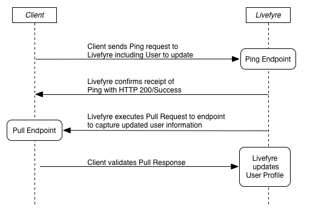

# Synchronisation avec Livefyre à l’aide de Ping pour Pull{#sync-with-livefyre-using-ping-for-pull}

Utilisez Ping for Pull pour synchroniser Livefyre avec votre système de gestion des utilisateurs.

En général, vous ***Ping*** Livefyre chaque fois qu’un utilisateur de votre site Web/application met à jour son profil (nom d’affichage, avatar, etc.) et Livefyre ***Capture*** le profil mis à jour de cet utilisateur.

Ping for Pull Sequence :

1. Le client envoie la demande Ping à Livefyre (y compris l’utilisateur à mettre à jour).
1. Livefyre confirme la réception de Ping avec HTTP 200/Success.
1. Livefyre traite la demande d&#39;extraction.
1. Files d&#39;attente Livefyre Demande d&#39;extraction.
1. Livefyre exécute une requête d’extraction vers le point de terminaison pour capturer les informations utilisateur mises à jour.
1. Le client reçoit une réponse d’extraction et valide.
1. Livefyre met à jour les Profils distants avec les informations de profil externe incluses dans le point de terminaison de extraction.

Ping Livefyre chaque fois qu’un utilisateur met à jour ses informations de profil. Bien que la durée de fin de Ping for Pull puisse varier en fonction de la charge réseau, elle met à jour les informations utilisateur dans un délai compris entre 1 et 10 minutes. Les modifications apportées au profil s’affichent d’abord dans Livefyre Studio > Utilisateurs.

Les informations de Profil mises à jour s’affichent dans vos applications Livefyre après deux événements :

* Un utilisateur se déconnecte, puis se reconnecte à l’application. Les valeurs de nom d’affichage dans l’attribut userAuthToken ont la priorité sur Ping pour les mises à jour de type extraction. Un utilisateur déconnecté/connecté actualise le jeton pour mettre à jour la session.

   Pour générer de nouveaux userAuthTokens lorsque les informations du profil sont mises à jour, utilisez SSO authDelegate pour déconnecter votre utilisateur puis le reconnecter en arrière-plan.

* Une mise à jour de l&#39;amorçage de la collection permettra d&#39;apporter les informations mises à jour (au plus toutes les 5-10 minutes).

Pour mettre en oeuvre Ping for Pull pour votre système de Profils utilisateur :

1. [Générez le point de terminaison](#t_build_the_pull_endpoint) Tirer.

   >[!NOTE]
   >
   >La bibliothèque Livefyre comprend une méthode syncUser pour tenir vos profils utilisateur à jour. Ignorez les deux étapes suivantes si vous utilisez la bibliothèque Livefyre.

1. [Enregistrez le point de terminaison Pull dans Studio](#register_the_endpoint_with_studio).
1. [Créez le ping](#t_build_the_ping).
1. [Créez le fichier Ping for Pull Response].(#reference_n3x_pzb_mz)
