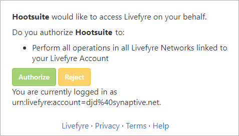

# Utilisation de Adobe Experience Manager Livefyre avec Hootsuite{#use-adobe-experience-manager-livefyre-with-hootsuite}

Découvrez comment utiliser Livefyre Experience Manager avec Hootsuite, ce qui vous permet de traiter, gérer et partager du contenu généré par l&#39;utilisateur directement à partir du tableau de bord Hootsuite.

## Utiliser Adobe Experience Manager Livefyre avec Hootsuite {#topic_FB6E613DBCF74F39ABD5045C501EA326}

Découvrez comment utiliser Livefyre Experience Manager avec Hootsuite, ce qui vous permet de traiter, gérer et partager du contenu généré par l&#39;utilisateur directement à partir du tableau de bord Hootsuite.

## Prise en main {#task_22699BD901C24384AB2DC02D926D8F4A}

Contexte de la tâche

1. Installez Adobe Experience Manager Livefyre for Hootsuite à partir du répertoire des applications Hootsuite.

1. Dans votre tableau de bord Hootsuite, cliquez sur **Connexion avec Adobe**.

   

1. Connectez-vous au Experience Manager Livefyre en utilisant vos identifiants Livefyre.
1. Cliquez sur **Autoriser** pour autoriser Hootsuite à accéder à vos bibliothèques.

   

   Une fois l’autorisation accordée, vous serez ramené au tableau de bord Hootsuite où vous pourrez rechercher des ressources dans vos bibliothèques Experience Manager Livefyre.

## Recherche de ressources {#task_0B011B0C539E400BB72A6DF69FBF66C0}

Contexte de la tâche

1. Cliquez sur l’icône de recherche dans la barre de menus pour rechercher des fichiers dans les bibliothèques Livefyre Experience Manager.

   

1. Cliquez sur **Sélectionner** et une fenêtre contextuelle s’affiche avec toutes vos bibliothèques.
1. Cliquez sur le dossier d’une bibliothèque, puis sur **Sélectionner un dossier** pour sélectionner la bibliothèque qui s’affichera dans votre flux Hootsuite.

   

## Options de filtrage {#concept_5D062A9CD61A4B2E90784E5AA31CB16D}

Vous pouvez filtrer les résultats de votre recherche à l’aide des sections Afficher les ressources de, Droits, Mots-clés et Balises.

Les options de filtrage sont les suivantes :

| Section | Description |
|--- |--- |
| Afficher les ressources à partir de | Sélectionnez cette option pour vue des ressources à partir de toutes les sources ou d’une source individuelle. Par exemple : Instagram, Twitter, Facebook, etc. |
| Droits | Sélectionnez cette option pour vue uniquement les fichiers dont le paramètre de droits est spécifique. |
| Mots-clés | Sélectionnez cette option pour filtrer les résultats par mots-clés ou balises. Le filtrage par mots-clés permet de rechercher le contenu textuel d’une publication, ainsi que le nom d’affichage et le nom d’utilisateur de l’auteur. |
| Balises | Sélectionnez cette option pour filtrer les résultats par mots-clés ou balises. Le filtrage par mots-clés permet de rechercher le contenu textuel d’une publication, ainsi que le nom d’affichage et le nom d’utilisateur de l’auteur. |

Une fois que vous avez sélectionné les paramètres de recherche, vos fichiers s’affichent en flux continu lors de la recherche :

### Options du menu de diffusion

Cliquez sur le nom ou l&#39;icône de l&#39;utilisateur pour afficher l&#39;utilisateur sur le réseau correspondant. Cliquez sur l’heure pour afficher l’article d’origine. Lorsque vous placez le pointeur de la souris sur l’élément, d’autres options s’affichent. Cliquez sur le partage 

ajoute la ressource actuelle à la zone de composition réseau, ce qui vous permet de la partager avec vos réseaux via Hootsuite.

>[!NOTE]
>
>Le bouton de partage s’affiche uniquement lorsque vous filtrez les fichiers dont les droits sont accordés.

Cliquez sur l&#39;icône Attribuer  pour affecter l&#39;élément actif à l&#39;un des membres de votre équipe Hootsuite. Si un élément a déjà été affecté, la commande Résoudre 

s&#39;affiche. Cliquez dessus pour résoudre l&#39;affectation actuelle.

### Autres menus d’application

Cliquez sur Paramètres 

vous permettra de déconnecter le compte Livefyre Experience Manager actuel et de vous connecter à un autre compte.

Cliquez sur le menu 

affiche les liens pour ce document, le support et le site Web de Synaptive.

## Module externe de l&#39;application Experience Manager Livefyre {#task_33C8CEF4F5E44830B970BB3A7AAA2AA6}

Outre la possibilité d’afficher vos bibliothèques de fichiers dans un flux Hootsuite, vous pouvez également enregistrer des éléments des flux Instagram, Twitter, Facebook et YouTube dans vos bibliothèques Livefyre Experience Manager.

1. Cliquez sur l&#39;icône de menu située au bas de chaque élément.

   

1. Sélectionnez **Envoyer à AEM Livefyre**.
1. Sélectionnez une ou plusieurs bibliothèques dans lesquelles enregistrer le fichier.

   

1. Cliquez sur **Enregistrer dans la bibliothèque** et l&#39;élément sera enregistré dans les bibliothèques que vous avez sélectionnées.

## Composant de bibliothèque multimédia Experience Manager Livefyre {#task_9CA2D5D49F8E463F9EF475BC09C8ACC9}

Vous pouvez accéder à vos ressources via les composants multimédia du compositeur de suite d’accueil.

1. Dans le compositeur, cliquez sur le lien **Open Media Library** dans la section **Media**.

   

1. Sélectionnez Adobe Experience Manager Livefyre dans le menu déroulant et vos fichiers s’afficheront.

   

1. Pour ajouter un fichier à la publication en cours, cliquez dessus. Pour rechercher un fichier spécifique, saisissez les termes de recherche dans la zone **Rechercher les médias** et les résultats s’affichent.
