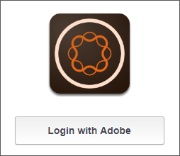

# Utiliser Adobe Experience Manager Livefyre avec Hootsuite{#use-adobe-experience-manager-livefyre-with-hootsuite}

Découvrez comment utiliser Experience Manager Livefyre avec Hootsuite, ce qui vous permet de traiter, gérer et partager directement le contenu généré par l'utilisateur depuis le tableau de bord Hootsuite.

## Utiliser Adobe Experience Manager Livefyre avec Hootsuite {#topic_FB6E613DBCF74F39ABD5045C501EA326}

Découvrez comment utiliser Experience Manager Livefyre avec Hootsuite, ce qui vous permet de traiter, gérer et partager directement le contenu généré par l'utilisateur depuis le tableau de bord Hootsuite.

## Prise en main {#task_22699BD901C24384AB2DC02D926D8F4A}

Contexte de la tâche

1. Installez Adobe Experience Manager Livefyre pour Hootsuite depuis le répertoire d'application Hootsuite.

1. Depuis votre tableau de bord Hootsuite, cliquez **sur Connexion avec Adobe**.

   

1. Connectez-vous à Experience Manager Livefyre à l'aide des informations d'identification Livefyre.
1. Cliquez **sur Autoriser** pour autoriser Hootsuite à accéder à vos bibliothèques.

   

   Une fois l'autorisation accordée, vous serez redirigé vers le tableau de bord Hootsuite où vous pouvez rechercher des fichiers dans les bibliothèques Experience Manager Livefyre.

## Rechercher des ressources {#task_0B011B0C539E400BB72A6DF69FBF66C0}

Contexte de la tâche

1. Cliquez sur l'icône de recherche dans la barre de menus pour rechercher des fichiers dans vos bibliothèques Experience Manager Livefyre.

   

1. Cliquez **sur Sélectionner** et une fenêtre contextuelle s'affiche avec toutes vos bibliothèques.
1. Cliquez sur le dossier d'une bibliothèque, puis cliquez **sur Sélectionner un dossier** pour sélectionner la bibliothèque qui sera affichée dans le flux Hootsuite.

   

## Options de filtrage {#concept_5D062A9CD61A4B2E90784E5AA31CB16D}

Vous pouvez filtrer vos résultats de recherche à l'aide des sections Afficher les éléments de, Droits, Mots-clés et Balises.

Les options de filtrage incluent :

| Section | Description |
|--- |--- |
| Afficher les fichiers de | Sélectionnez cette option pour afficher les fichiers provenant de toutes les sources ou d'une source individuelle. Par exemple : Instagram, Twitter, Facebook, etc. |
| Droits | Sélectionnez cette option pour afficher uniquement les fichiers ayant un paramètre de droits spécifique. |
| Mots-clés | Sélectionnez cette option pour filtrer les résultats par mots-clés ou balises. Le filtrage par mots-clés recherche le contenu textuel d'une publication ainsi que le nom d'affichage et le nom d'utilisateur de l'auteur. |
| Balises | Sélectionnez cette option pour filtrer les résultats par mots-clés ou balises. Le filtrage par mots-clés recherche le contenu textuel d'une publication ainsi que le nom d'affichage et le nom d'utilisateur de l'auteur. |

Une fois que vous avez sélectionné les paramètres de recherche, vos fichiers sont affichés dans le flux lors de la recherche :

### Options du menu de diffusion en continu

Cliquez sur le nom ou l'icône de l'utilisateur pour afficher l'utilisateur sur le réseau correspondant. Cliquez sur l'heure pour afficher l'article original. Lorsque la souris se trouve sur l'élément, d'autres options s'affichent. Cliquez sur Partager 

ajoute l'actif actif à la zone Composer le réseau, ce qui vous permet de le partager avec vos réseaux via Hootsuite.

>[!NOTE]
>
>Le bouton Partager s'affiche uniquement lorsque vous filtrez les fichiers avec droits autorisés.

Cliquez sur  l'icône Attribuer pour attribuer l'élément actif à l'un de vos membres de l'équipe Hootsuite. Si un élément a déjà été attribué, la résoudre 

s'affiche. Cliquez sur ce lien pour résoudre l'affectation actuelle.

### Autres menus d'application

Cliquez sur les Paramètres 

vous permet de déconnecter le compte Experience Manager Livefyre actuel et de vous connecter à un autre.

Cliquez sur le menu 

affiche les liens de ce document, de ce support et du site Web de Synaptive.

## Plug-in d'application Experience Manager Livefyre {#task_33C8CEF4F5E44830B970BB3A7AAA2AA6}

Outre la possibilité d'afficher vos bibliothèques de fichiers dans un flux Hootsuite, vous pouvez également enregistrer des éléments des flux Instagram, Twitter, Facebook et YouTube vers vos bibliothèques Experience Manager Livefyre.

1. Cliquez sur l'icône de menu située au bas de chaque élément.

   

1. Sélectionnez **Envoyer à AEM Livefyre**.
1. Sélectionnez une ou plusieurs bibliothèques dans lesquelles enregistrer le fichier.

   

1. Cliquez **sur Enregistrer dans la bibliothèque**et l'élément sera enregistré dans les bibliothèques que vous avez sélectionnées.

## Composant Bibliothèque de supports Experience Manager Livefyre {#task_9CA2D5D49F8E463F9EF475BC09C8ACC9}

Vous pouvez accéder à vos ressources via les composants Media de Hootsuite Composer.

1. Dans le compositeur, cliquez sur le lien **Ouvrir la bibliothèque** multimédia dans la section **Média** .

   

1. Sélectionnez Adobe Experience Manager Livefyre dans le menu déroulant et vos fichiers s'affichent.

   

1. Pour ajouter un fichier à la publication actuelle que vous écrivez, cliquez dessus. Pour rechercher un fichier spécifique, entrez les termes recherchés dans **la zone de recherche de supports** et les résultats s'affichent.
